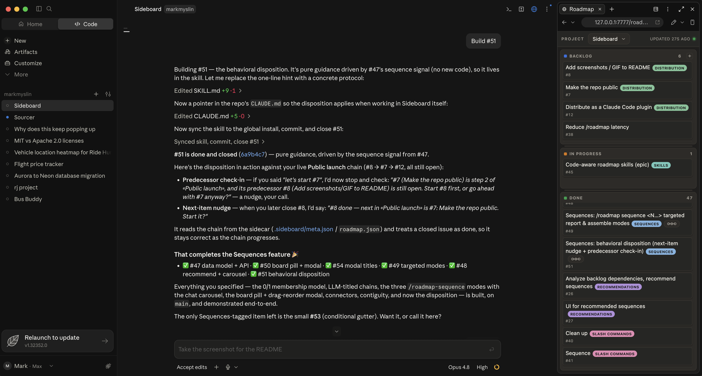

# Sideboard

**Your GitHub Issues as a live roadmap board in Claude Code.**

Sideboard shows your repo's GitHub Issues as a live roadmap board that you and [Claude Code](https://claude.com/claude-code) drive together. Quickly log ideas for the backlog, start Claude on the next issue, and reason across your roadmap **and** codebase in context — no need to jump out of Claude Code to an external board.



Claude Code has no API for custom side panels, but its desktop app lets you pin any local web page in the **preview pane** next to chat. Sideboard is that page: a zero-dependency HTML board whose source of truth is your **GitHub Issues**. A companion **skill** teaches Claude to keep the board current with `gh` during normal conversation — filing what you decide to build, moving cards to *In Progress*, closing them *Done* when work lands. It refreshes on its own — board edits show instantly, and changes made with `gh` directly appear on the next GitHub sync.

## Code-aware roadmap skills

Because Claude holds your roadmap **and** your codebase in context, Sideboard ships commands that reason across both — and they always propose first, never acting until you accept. Installed as a plugin, the commands are namespaced `sideboard:`:

- **`/sideboard:roadmap-suggest`** — mines the repo for work the board is missing (TODOs, stubs, churn-heavy files, gaps, features the docs promise) and offers them as a checklist. On a brand-new project it bootstraps a starter backlog from scratch.
- **`/sideboard:roadmap-sequence`** — finds dependency chains: report or assemble specific issues, or scan the board and recommend build-orders in a chat carousel. The board draws each chain as a connector down the lane.
- **`/sideboard:roadmap-cleanup`** — flags issues that are already done (confirmed against the actual code) or redundant, and closes/merges them on your OK.

## How it works

- **GitHub Issues are the source of truth.** Each card is an issue; `#N` is its number; a **closed issue = Done**.
- **`.sideboard/meta.json`** — a small committed sidecar — holds what GitHub doesn't: the Backlog↔In Progress split, card order, tag colors, and dependency sequences. The router reconciles it automatically — GitHub wins for content and open/closed; the sidecar wins for lane split and order.
- **`scripts/sideboard_router.py`** serves the board on `127.0.0.1:7777`, rebuilding it from `gh issue list` + the sidecar on each sync. One router serves *all* your projects and follows whichever one you're working in.
- **`roadmap-board.html`** (at the repo root) is a zero-dependency kanban — three columns (Backlog → In Progress → Done), feature-tag chips, drag to move/reorder, add/edit inline. Light and dark themes are automatic.

## What it runs on your machine

Claude Code plugins run with your user privileges, so it's worth knowing exactly what Sideboard does — it's deliberately narrow:

- **A localhost-only HTTP server** (`scripts/sideboard_router.py`) bound to `127.0.0.1:7777`. It never listens on a public interface and makes no outbound network calls of its own.
- **`gh` on your behalf** — `gh issue list/create/edit/close` and `gh label` — to read and update the roadmap. All GitHub access goes through your already-authenticated `gh`; the plugin stores no tokens or credentials.
- **Two hooks** — on session start and on each prompt, a small bash script (`scripts/sideboard-active.sh`) tells the running server which project is active. It always exits 0, so it never *fails* your prompt. Timing: normally one ~1s-capped local request; when the server is down, the hook also restarts it — killing whatever process holds the port (matched strictly by *listening* on it) and launching a fresh one — which can block a prompt for ~3–4s, at most once per 60s.
- **Local state under `~/.claude`** — a write-auth token (`sideboard-token`, readable only by you), a title→project registry (`sideboard-projects.json`), a server log, and two relaunch-throttle stamps. Nothing leaves your machine.

It doesn't download or execute remote code, phone home, or touch anything beyond your repos' issues and the committed `.sideboard/meta.json`.

## Prerequisites

- **macOS or Linux.** The board server and hooks are bash + `python3`; on Windows you'd need a bash shell (Git Bash or WSL).
- A git repo **under `~/Documents/Projects/`** with a **GitHub remote and Issues enabled**. The router discovers projects in that root; to keep repos elsewhere, point it at them with `SIDEBOARD_PROJECTS_ROOT=/path` (or add a title→dir entry to `~/.claude/sideboard-projects.json`).
- **`gh`** installed and authenticated (`gh auth login`).
- **`python3`** on PATH (runs the local board server).
- **`curl`** on PATH (the hook and launcher talk to the local server).

## Install

Sideboard is a **Claude Code plugin**. From inside Claude Code:

```
/plugin marketplace add mmyslin/sideboard
/plugin install sideboard@sideboard
```

That's it — no `git clone`, no `settings.json` editing. The plugin ships the skill, the four `sideboard:` commands, the board, the router, and the activity hook; the `SessionStart` hook starts the board server for you. Start (or restart) a session and the commands are available in every project.

<details>
<summary>Legacy install (without the plugin)</summary>

```bash
git clone https://github.com/mmyslin/sideboard.git
cd sideboard
./install.sh
```

Copies the skill, board, router, and activity hook into `~/.claude/skills/sideboard/` and merges the hook into your `settings.json`. Kept for users not on the plugin flow; the plugin is the supported path.

**Switching from the legacy install to the plugin?** Remove the old hook so it doesn't fire alongside the plugin's. It's harmless (the router is a single idempotent `:7777` process — the duplicate just no-ops), but to keep things clean, delete the `SessionStart`/`UserPromptSubmit` entries pointing at `~/.claude/skills/sideboard/sideboard-active.sh` from `~/.claude/settings.json`.
</details>

## Use

In any repo that meets the prerequisites, ask Claude to **"set up the roadmap"** (or run `/sideboard:roadmap`). Claude bootstraps the sidecar so the router discovers the project, and opens `http://127.0.0.1:7777/roadmap-board.html` in the preview pane (the `SessionStart` hook already has the board server running). Drag the pane beside your chat and **save the layout** — from then on, as you and Claude decide what to build and as `gh issue` changes land, the board keeps itself current. Re-open it any time with `/sideboard:roadmap`.

## Uninstall

`/plugin uninstall sideboard@sideboard` removes the plugin, but the board **server keeps running** — the `:7777` router was started by the session hook and nothing signals it to stop. Shut it down by killing exactly the process listening on the port (don't `pkill` by file name — that can hit an editor viewing the source):

```bash
lsof -ti tcp:7777 -sTCP:LISTEN | xargs kill
```

Your roadmap lives in GitHub Issues and the committed `.sideboard/meta.json`, so stopping the server loses nothing. To remove the local state Sideboard kept under `~/.claude` (auth token, title→project registry, server log, throttle stamps):

```bash
rm -f ~/.claude/sideboard-token ~/.claude/sideboard-projects.json ~/.claude/sideboard-router.log ~/.claude/sideboard-relaunch.stamp ~/.claude/sideboard-heal.stamp
```

(Repos keep their committed `.sideboard/meta.json`; if a corrupt or migrated sidecar was ever backed up you may also find `meta.json.*.bak` files beside it — safe to delete.)

## Notes

- The board is served on `127.0.0.1` (localhost only). Don't bind it to `0.0.0.0`.
- `.sideboard/meta.json` is meant to be **committed** — it carries your lane split, order, tag colors, and sequences. The board HTML is served by the router from the plugin's own directory; nothing needs to be copied into your repos.
- Requires the Claude Code desktop app (the one with the preview pane) to pin the board beside chat. Any browser works too — it's just a local web page.

## License

MIT © 2026 Mark Myslin
